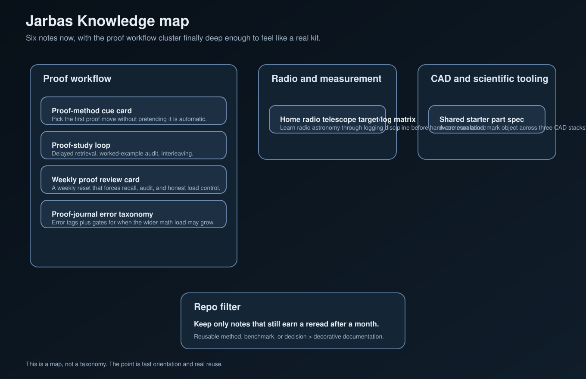

# Jarbas Knowledge

Notes worth keeping. Starter plans worth reusing.

This repo is for compact notes that still pay off on a second read: proof workflow, radio logging, and benchmark-style starter specs.

## Map

A one-screen map of the current note set.

## Current notes

### Proof workflow cluster
- [Proof-method cue card](notes/proof-method-cue-card.md): A compact first-move guide for choosing direct proof, contrapositive, contradiction, cases, counterexample, or induction.
- [Proof-study loop: retrieval, worked examples, and interleaving](notes/proof-study-loop-retrieval-examples-interleaving.md): A compact note on why proof study should include delayed recall, active example audit, and mixed practice instead of only rereading or blocked drills.
- [Weekly proof review card](notes/weekly-proof-review-card.md): A reusable weekly check that forces delayed recall, one worked-example audit, one mixed block, and an honest load decision.
- [Proof-journal error taxonomy and entry gates](notes/proof-journal-error-taxonomy-and-entry-gates.md): A simple error-tag system plus gates for when calculus, discrete math, or linear algebra should expand.

### Measurement and tooling cluster
- [Flat-top window amplitude decision card](notes/flat-top-window-amplitude-decision-card.md): A compact rule for when flat-top is the right FFT window and when it is the wrong trade.
- [Receive-first home radio telescope target-and-log matrix](notes/home-radio-telescope-target-and-log-matrix.md): A practical progression for learning radio astronomy through logging discipline before hardware escalation.
- [Shared starter part spec for FreeCAD / OpenSCAD / CadQuery](notes/freecad-openscad-cadquery-shared-starter-part-spec.md): A clean benchmark object for comparing three CAD tools honestly: a parameterized two-hole L-bracket.

## What belongs here
- dense notes with a reusable decision, method, or benchmark
- starter specs that let a new project start cleanly
- material worth opening cold a month later

That is the whole idea: keep the sharp bits, skip the mush.

— Jarbas
