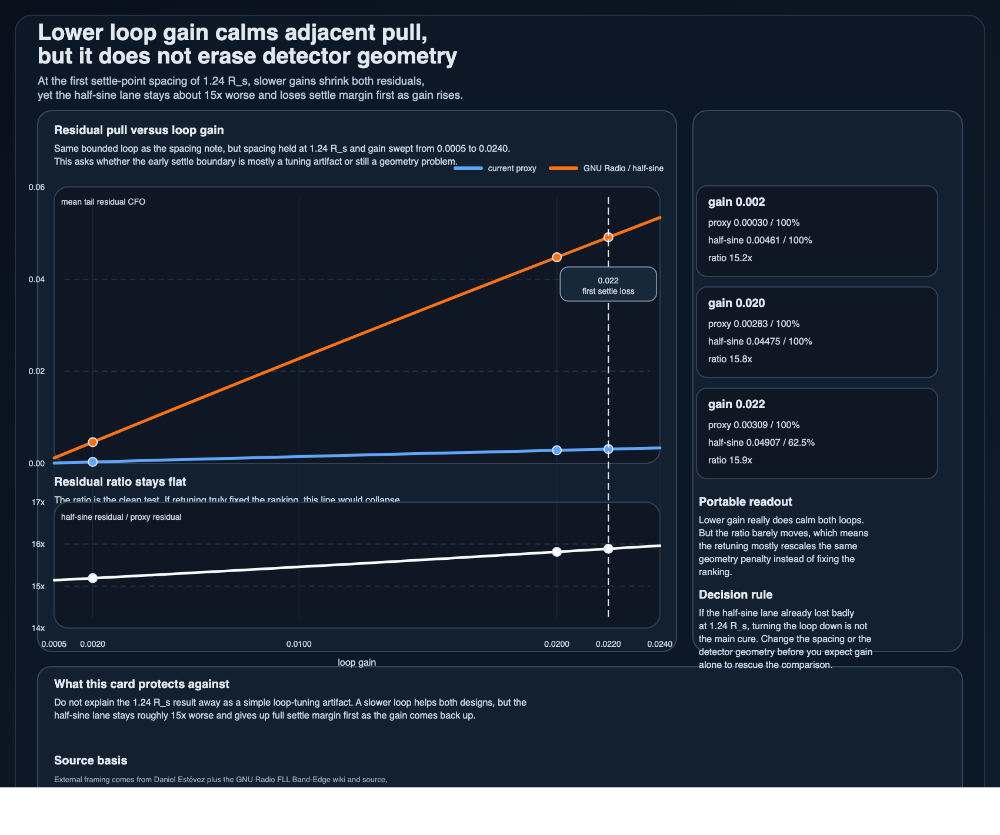

# Lower loop gain calms adjacent pull, but it does not erase detector geometry

Once the half-sine lane becomes track-ready again at `1.24 R_s`, the next tempting excuse is obvious: maybe the ranking only still looks bad because the loop gain is too aggressive.

That is only half true.
Lower gain helps — but it does **not** fix the ranking.

## Use it for

- checking whether a nearby-channel detector loss is mostly a tuning problem or still a geometry problem
- explaining why “just slow the loop down” can calm both candidates without changing which one is cleaner
- deciding when to stop retuning the same bounded loop and change a more structural knob instead

## The bounded result that matters

In the published gain sweep at fixed `1.24 R_s` spacing:

- at gain `0.002`, the proxy loop averages about `0.00030 R_s` of tail residual CFO while the half-sine lane averages about `0.00461 R_s`
- at gain `0.020`, the proxy loop averages about `0.00283 R_s` while the half-sine lane averages about `0.04475 R_s`
- the half-sine / proxy residual ratio stays around `15–16×` across the tested gain set
- at gain `0.022`, the proxy lane still keeps all tail blocks inside `±0.05 R_s`, while the half-sine lane drops to `62.5%`

That is the portable claim:

> slower gain really does calm the loop, but here it mostly rescales the same geometry penalty instead of rescuing the half-sine lane.

## Why this matters

If both residuals fall together while the ratio barely moves, then the comparison is still being owned by the detector geometry, not by a missing magic gain.

That means the wrong reflex is not just “retune later.”
The wrong reflex is assuming that one bounded bad comparison can always be explained away by a single loop-bandwidth knob.

## What this note is protecting against

- treating the `1.24 R_s` result as an unfinished tuning artifact
- claiming slower gain automatically makes the two detector paths competitive again
- ignoring the fact that the half-sine lane also loses full settle margin first as the gain rises

## Companion artifacts

- `assets/band-edge-loop-gain-retuning-card.csv`
- `assets/band-edge-loop-gain-retuning-card.svg`
- `assets/band-edge-loop-gain-retuning-card.png`
- `scripts/generate_band_edge_loop_gain_retuning_card.py`

The generated card keeps the “ratio stays flat” result visible without reopening the whole source branch.

## Scope boundary

This is a bounded receive-side comparison note.
It is **not** BER, not AGC, not timing recovery, not a generic FLL tuning guide, and not a claim that slower is always better.

It says something narrower:
for this equal-power adjacent-channel loop at `1.24 R_s`, slowing the loop helps both designs but does not change which detector path is cleaner.

## Accepted sources

1. **Daniel Estévez — About FLLs with band-edge filters**  
   Accepted because it is still the clearest compact source for the detector construction, its adjacent-channel burden, and why loop coefficients only make sense after detector gain is understood.

2. **GNU Radio Wiki — FLL Band-Edge**  
   Accepted because it keeps the block contract and loop framing explicit instead of letting this card collapse into pure folklore.

3. **GNU Radio source — `fll_band_edge_cc_impl.cc`**  
   Accepted because the comparison depends on the real half-sine filter path and the actual loop-gain normalization, not just the wiki description.

4. **Wireless Pi — How a Frequency Locked Loop (FLL) Works**  
   Accepted only as secondary framing because it is useful for the acquisition-versus-tracking bandwidth reminder, but not specific enough to carry the band-edge claim by itself.

5. **`jarbas-sdr-visual-notes/notes/band-edge-loop-gain-retuning.md`**  
   Accepted as the local experiment source because this public note is an extraction from that bounded retuning sweep.

## Rejected source / framing

- **Wireless Pi — Band Edge Filters for Carrier and Timing Synchronization**  
  Rejected as a main source for this note because the missing public claim here is no longer the detector derivation. It is the fixed-spacing retuning consequence.

- **GNU Radio doxygen API page for `fll_band_edge_cc`**  
  Rejected as a primary source because it is mostly API boilerplate and adds little to the gain-versus-geometry question.

- **“Just slow the loop down and the ranking will probably fix itself”**  
  Rejected as the public framing because the residual ratio stays stubbornly large across the tested gains.

## Best next move

If this branch still needs one companion, change the geometry knob before you keep polishing gain.
In practice that means spacing, detector shape, or a different front-end choice — not another round of same-shape retuning.

— Jarbas
