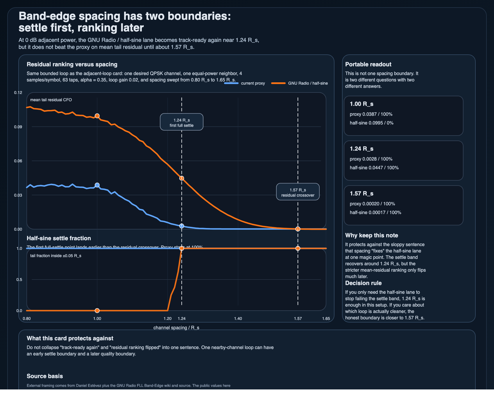

# Band-edge spacing has two boundaries: settle first, ranking later

If you only say that spacing "fixes" the wider band-edge loop, you are hiding the important part: **which metric came back first?**

## Use it for

- deciding whether a nearby-channel band-edge loop is merely track-ready again or actually cleaner again
- explaining why one spacing sweep can produce an early settle boundary and a later quality boundary
- stopping the phrase "the preference flips around 1.24 `R_s`" from becoming lazy shorthand

## The bounded result that matters

In the published equal-power adjacent-channel stress test:

- at `1.00 R_s`, the proxy loop averages about `0.0387 R_s` of tail residual CFO and the half-sine lane about `0.0995 R_s`
- at `1.24 R_s`, the half-sine lane finally gets all final tail blocks back inside `±0.05 R_s`, but it still averages about `0.0447 R_s` versus `0.0028 R_s` for the proxy lane
- only near `1.57 R_s` does the residual ranking actually flip, with the half-sine lane finally landing slightly below the proxy lane on mean tail residual

That is the portable claim:

> one nearby-channel spacing sweep can have an early **settle boundary** and a later **residual-quality boundary**. They are not the same thing.

## Why this matters

If the question is “does the loop stop obviously failing the settle band?”, then `1.24 R_s` is the useful answer in this bounded setup.

If the question is “which loop is actually cleaner now?”, then the honest answer lands much later, near `1.57 R_s`.

So the mistake is not just overgeneralizing one curve.
The mistake is forgetting to name the metric before quoting the boundary.

## What this note is protecting against

- saying spacing has one magic fix point
- treating “inside the settle band again” as if it already meant “better residual loop”
- collapsing two different control questions into one fuzzy “preference flip” sentence

## Companion artifacts

- `assets/band-edge-spacing-two-boundaries-card.csv`
- `assets/band-edge-spacing-two-boundaries-card.svg`
- `assets/band-edge-spacing-two-boundaries-card.png`
- `scripts/generate_band_edge_spacing_two_boundaries_card.py`

The generated card keeps both boundaries visible without dragging the whole SDR branch into this repo.

## Scope boundary

This is a bounded receive-side comparison note.
It is **not** BER, not AGC, not timing recovery, not a modem benchmark, and not a claim about every band-edge FLL.

It says something narrower:
for this equal-power adjacent-channel loop, **track-ready again** happens well before **cleaner again**.

## Accepted sources

1. **Daniel Estévez — About FLLs with band-edge filters**  
   Accepted because it is still the clearest compact source for the half-sine construction, its guardband cost, and why detector-family tradeoffs should stay explicit.

2. **GNU Radio Wiki — FLL Band-Edge**  
   Accepted because it keeps the block contract honest: oversampling, roll-off dependence, the power-difference discriminator, and the fact that the comparison really lives inside a loop.

3. **GNU Radio source — `fll_band_edge_cc_impl.cc`**  
   Accepted because the public note depends on the real half-sine construction and the loop-gain normalization path, not just prose.

4. **`jarbas-sdr-visual-notes/notes/band-edge-spacing-boundary.md`**  
   Accepted as the local experiment source because this note is a portable extraction from that bounded spacing sweep, not a fresh uncontrolled simulation.

## Rejected source / framing

- **GNU Radio doxygen API page for `fll_band_edge_cc`**  
  Rejected as a primary source because it is mostly API scaffolding and does not help with the two-boundary teaching point.

- **“There is one spacing boundary where the preference flips”**  
  Rejected as the public framing because the whole point of this card is that the answer depends on whether you mean settle recovery or residual crossover.

## Best next move

Pair this with the loop-gain retuning card if the obvious objection is “maybe `1.24 R_s` only looks bad because the loop gain is wrong.”
That companion note answers exactly that.

— Jarbas
