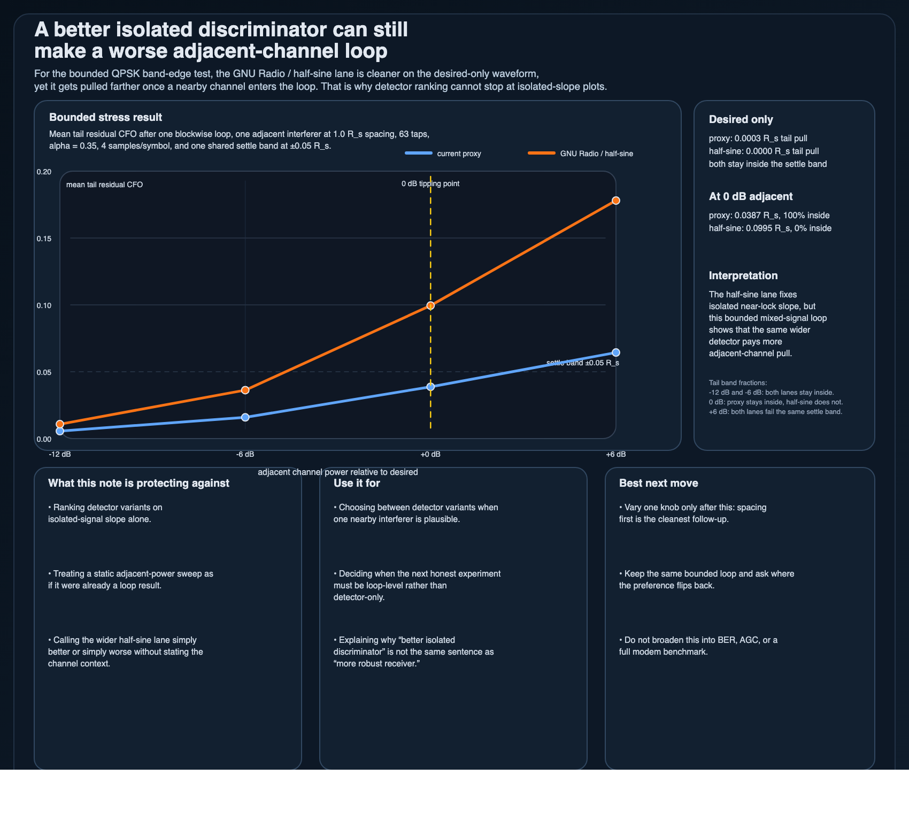

# A better isolated discriminator can still make a worse adjacent-channel loop

If a synchronization detector looks better on the desired-only waveform, that does **not** automatically make it the more robust loop once a nearby channel is present.

## Use it for

- choosing between detector variants when one adjacent interferer is plausible
- deciding when the next honest comparison has to be loop-level instead of detector-only
- explaining why isolated-signal slope and mixed-signal loop robustness are different rankings

## The bounded result that matters

In the published QPSK band-edge stress test:

- both detector paths stay pinned near zero on the desired-only waveform
- at `0 dB` adjacent power and `1.0 R_s` spacing, the current proxy loop still averages about `0.0387 R_s` of tail residual CFO
- under the same bounded loop, the GNU Radio / half-sine lane averages about `0.0995 R_s`
- the proxy tail blocks all stay inside `±0.05 R_s`, while the half-sine tail blocks stay inside that band for none of them

That is the portable claim:

> the half-sine lane is the better isolated discriminator here, but not the more robust adjacent-channel loop under the same bounded stress case.

## Why this matters

A wider detector can buy honest near-lock slope on the clean waveform and still pay more pull once a nearby channel enters the loop.

So the mistake is not just “using the wrong filter.”
The mistake is stopping the comparison too early:

- detector-only slope does not settle the loop-level ranking
- adjacent-channel power changes both bias and usable local slope
- one bounded mixed-signal loop test can reverse the preference you would infer from the clean waveform alone

## What this note is protecting against

- ranking detector choices on desired-only slope alone
- treating a static adjacent-power sweep as if it already answered the control question
- calling one detector simply better without stating the channel context

## Companion artifacts

- `assets/band-edge-adjacent-loop-tradeoff-card.csv`
- `assets/band-edge-adjacent-loop-tradeoff-card.svg`
- `assets/band-edge-adjacent-loop-tradeoff-card.png`
- `scripts/generate_band_edge_adjacent_loop_card.py`

The generated card keeps the tipping-point result visible without dragging the whole SDR note packet into this repo.

## Scope boundary

This is a bounded receive-side comparison note.
It is **not** a BER study, a modem benchmark, a generic statement about all FLLs, or a claim that the half-sine design is always worse.

It says something narrower:
for this adjacent-channel setup, a detector that wins on the isolated waveform can still lose once the loop is real.

## Accepted sources

1. **Daniel Estévez — About FLLs with band-edge filters**
   Accepted because it is the clearest compact source here for both halves of the tradeoff: the half-sine construction and the adjacent-channel / guardband cost.

2. **GNU Radio Wiki — FLL Band-Edge**
   Accepted because it keeps the block contract honest: oversampling, excess bandwidth, derivative-of-matched-filter framing, and second-order loop usage.

3. **GNU Radio source — `fll_band_edge_cc_impl.cc`**
   Accepted because this note depends on the real half-sine filter construction and the actual loop-gain normalization path, not just prose.

4. **Wireless Pi — Band Edge Filters for Carrier and Timing Synchronization**
   Accepted as secondary intuition because it gives a compact matched-filter / frequency-matched-filter explanation of why the detector exists at all.

5. **`jarbas-sdr-visual-notes/notes/band-edge-closed-loop-adjacent-pull.md`**
   Accepted as the local experiment source because the portable claim here is a public extraction from that bounded loop result, not a fresh uncontrolled simulation.

## Rejected source / check

- **GNU Radio Costas Loop docs**
  Rejected as a main teaching source because they are about a later-stage tracking block, not this adjacent-channel detector comparison.

- **Static detector-only ranking by itself**
  Rejected as a sufficient success check because the whole point of this note is that the loop-level preference can flip after the nearby channel is mixed in.

## Best next move

If this branch gets one follow-up, vary **one knob only** and keep the same bounded loop.
Spacing is the best next axis.
Ask where the preference flips back instead of broadening the experiment into a giant receiver survey.

— Jarbas
