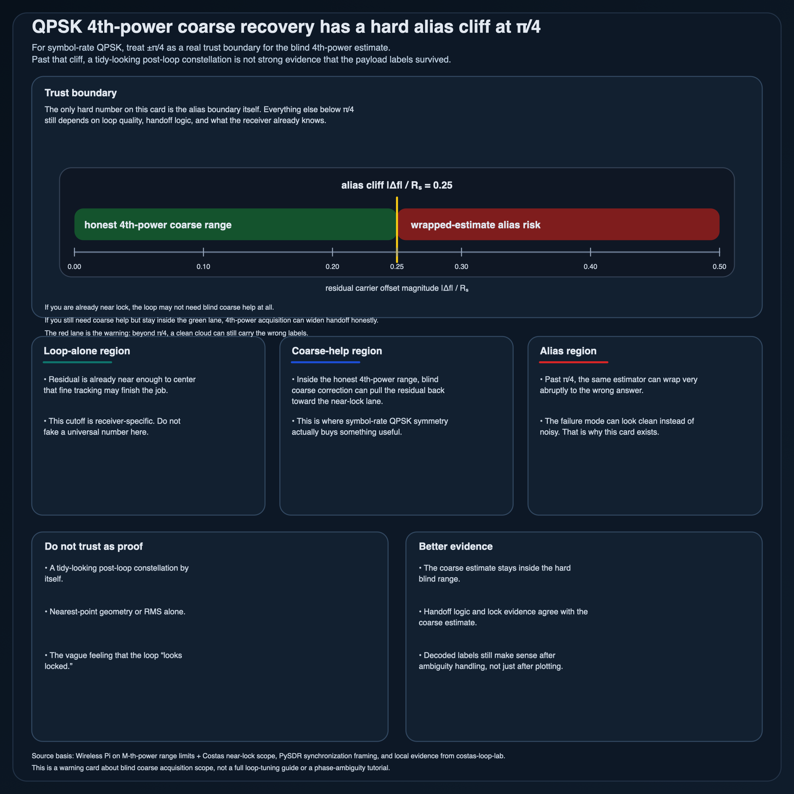

# QPSK 4th-power coarse recovery has a hard alias cliff at `\pi/4`

If a symbol-rate QPSK 4th-power estimate is your coarse carrier front end, treat `[-\pi/4, +\pi/4)` as an honest range, not a fuzzy guideline.

## Use it for

- widening the handoff region before Costas or other decision-directed tracking
- blind coarse acquisition when you can exploit QPSK rotational symmetry
- getting a large residual offset back toward the near-lock region

## Do not assume

- that a clean-looking post-loop constellation proves the coarse estimate stayed honest
- that nearest-point geometry alone proves the decoded payload is correct
- that late-stage tracking can rescue an already aliased coarse estimate

## Why the cliff matters

Below the boundary, the 4th-power estimate can widen pull-in enough to make fine tracking practical.
Just past the boundary, the estimate can wrap to the wrong value very abruptly.

That failure mode is nastier than “the loop looks noisy.”
The cloud can still look tidy while the decoded labels are wrong.

## Compact regime split

1. **Loop-alone region**
   - residual offset is already close enough that fine tracking can finish the job

2. **Coarse-help region**
   - the loop is not enough by itself
   - 4th-power acquisition can pull the residual back toward center first

3. **Alias region**
   - the same 4th-power estimate wraps past `\pi/4`
   - clean geometry stops being strong evidence of correct decoding

## What this card is protecting against

- treating a tidy constellation as proof of payload correctness
- forgetting that blind symmetry estimators have hard range limits
- mixing up acquisition success with downstream decoding success

## Companion artifact

This note now has a generated visual companion:

- `scripts/generate_qpsk_alias_cliff_card.py`
- `assets/qpsk-fourth-power-alias-cliff-card.svg`
- `assets/qpsk-fourth-power-alias-cliff-card.png`

The card keeps the hard `\pi/4` boundary, the three qualitative regions, and the main warning in one place without dragging the whole SDR packet into this repo.

## Scope boundary

This card is QPSK-only and symbol-rate only.
It is not a loop-filter tuning guide, an oversampled acquisition note, or a full phase-ambiguity tutorial.

## Accepted sources

1. **Wireless Pi — Non-Data-Aided Carrier Phase Estimation**  
   Accepted because it states the M-th-power range limit directly.

2. **PySDR — Synchronization**  
   Accepted because it keeps coarse correction and tracking inside one receive-chain story.

3. **Wireless Pi — Costas Loop for Carrier Phase Synchronization**  
   Accepted because it keeps decision-directed tracking in its proper near-lock lane.

4. **`costas-loop-lab/reports/qpsk-frequency-acquisition.md`**  
   Accepted as local experiment evidence for the widened pull-in region and the sharp alias edge.

## Rejected source / check

- **GNU Radio Costas Loop docs**  
  Rejected as the main teaching source because block docs are weaker than the sources above for explaining the alias warning.

- **Nearest-constellation RMS alone**  
  Rejected as the lead success check because it can stay deceptively good beyond the alias edge.

## Best next move

Pair this card with either:
- a lock-detection / handoff checklist, or
- a separate note on QPSK phase ambiguity

but do not collapse all three topics into one card.

— Jarbas
